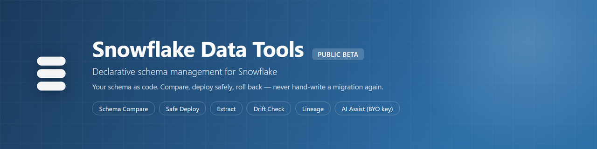
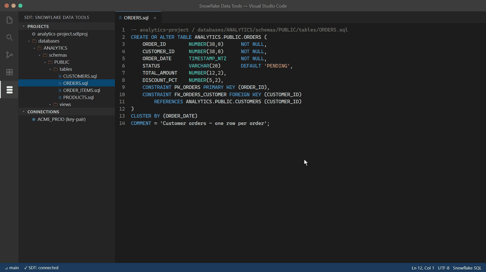
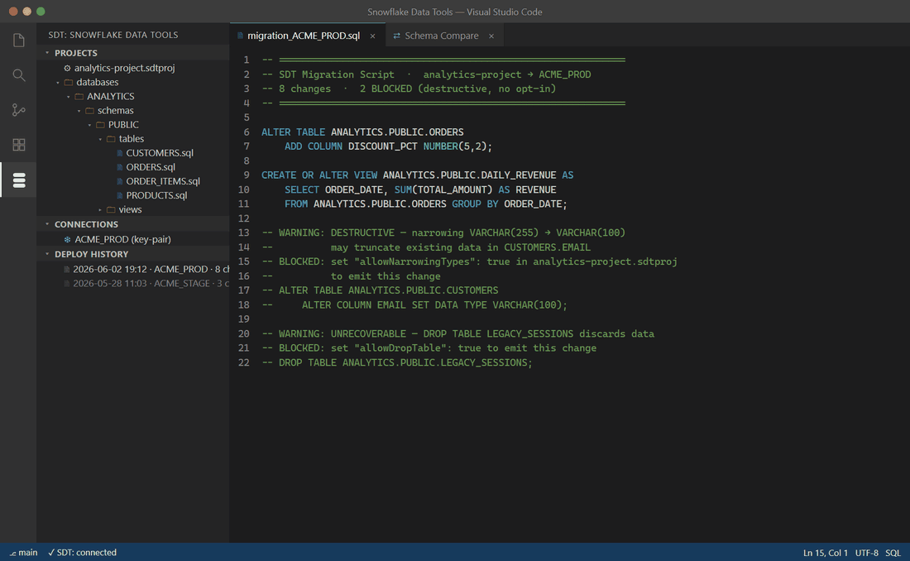

# SDT — Snowflake Data Tools



[](https://marketplace.visualstudio.com/items?itemName=sdt-ddt-tools.sdt-vscode)
[](https://marketplace.visualstudio.com/items?itemName=sdt-ddt-tools.sdt-vscode)
[](https://www.npmjs.com/package/@sdt-tools/cli)

**Declarative schema management for Snowflake, from VS Code and the CLI.** Author your schema as `.sql` files, compare them against a live account, and deploy with a safety classifier that refuses to do dangerous things silently.

> **Public Beta** — all features are free during the 30-day beta. AI features are bring-your-own-API-key. See [Beta program](#beta-program) below.

This repository is the **public home** for SDT — release notes, privacy policy, support, and issue tracking. **The product source code is not published here.**

---

## What SDT is

Snowflake gives you `CREATE OR ALTER TABLE` as a primitive but no workflow around it — no compare engine, no safety classification, no rollback story. SDT fills that gap. You author each Snowflake object as a `.sql` file (a desired-state spec), and SDT computes the deltas between your project and the live account — you never hand-write forward/backward migration files. Every proposed change is classified `SAFE`, `DESTRUCTIVE`, `EXPENSIVE`, or `UNRECOVERABLE`, and anything destructive refuses to run without an explicit opt-in. The result is a reviewable migration script plus a captured manifest you can roll back.

It is, in short, what Microsoft's SQL Database Projects / SqlPackage are for SQL Server — built natively for Snowflake, cross-platform (pure Node, no .NET), and AI-aware.

**Highlights:**

- **Schema compare** — diff a project, a built `.sdtpac`, or a live account in any direction, with per-change safety classification inline.
- **Safe deploy** — destructive operations gated behind explicit opt-ins (`allowDropTable`, `allowDropColumn`, …); optional zero-copy clone for `SWAP`-based rollback.
- **Extract / reverse-engineer** — pull a live account into a tree of `.sql` files.
- **Object Explorer, lint, format, lineage, drift check, deploy history, IntelliSense.**
- **AI assist (bring your own key)** — sketch objects from a description, suggest safer alternatives for risky changes, and an "Ask SDT" chat panel.

## See it in action

**Schema compare with a safety verdict on every change** — `SAFE` / `DESTRUCTIVE` / `EXPENSIVE` / `UNRECOVERABLE`, before anything touches your live account:



**Deploys that refuse to destroy data silently** — destructive changes come out blocked as comments until you opt in, and a zero-copy clone makes every deploy one command away from rollback:



**Reverse-engineer an entire account in seconds** — one command, one `.sql` file per object, ready for git:


## Install

- **VS Code extension:** install [**SDT — Snowflake Data Tools**](https://marketplace.visualstudio.com/items?itemName=sdt-ddt-tools.sdt-vscode) from the VS Code Marketplace.
- **CLI:**

  ```sh
  npm install -g @sdt-tools/cli
  sdt --version
  ```

**Requirements:** VS Code 1.90+; Node.js 20+ for the CLI; works on Windows, macOS, and Linux. Connects to Snowflake Standard, Enterprise, and Business Critical editions.

## Beta program

SDT is in a **30-day public beta**. During the beta:

- **Every feature is free** — the full deterministic engine plus all AI write-side features.
- **AI features are bring-your-own-key** — your prompts go directly from your machine to your chosen AI provider under your own account; SDT never sees, proxies, or stores that traffic.
- **Please report bugs.** That's the whole point of a beta — see [SUPPORT.md](./SUPPORT.md). If you opted into automatic error reporting on first run, a crash may already have sent us a sanitized diagnostic; a GitHub issue with what you were doing still helps a lot.

After the beta the deterministic core (compare, safe deploy, extract, lint, format, lineage, Object Explorer, schema diagram) stays free; AI write-side and some ownership features move to a Pro tier. Details will be posted in [RELEASES.md](./RELEASES.md).

## Privacy

SDT's telemetry is **opt-in** and heavily sanitized — your SQL, identifiers, table/column names, data, and credentials **never** leave your machine. AI features are bring-your-own-key with no AI subprocessor on our side. Full details: **[PRIVACY.md](./PRIVACY.md)**.

## Support

Bug reports, feature requests, and questions: **[SUPPORT.md](./SUPPORT.md)**. Quick paths: open a [GitHub issue](https://github.com/GVOrganization/sdt-tools/issues/new/choose), run `sdt feedback`, or email sdt.ddt.tools@gmail.com.

## Links

- Privacy policy: [PRIVACY.md](./PRIVACY.md)
- Support & help: [SUPPORT.md](./SUPPORT.md)
- Release notes: [RELEASES.md](./RELEASES.md)
- Sibling product (Databricks): https://github.com/GVOrganization/ddt-tools

---

_SDT is an independent tool and is not affiliated with, endorsed by, or sponsored by Snowflake Inc. "Snowflake" is a trademark of Snowflake Inc., used here for descriptive purposes only._
