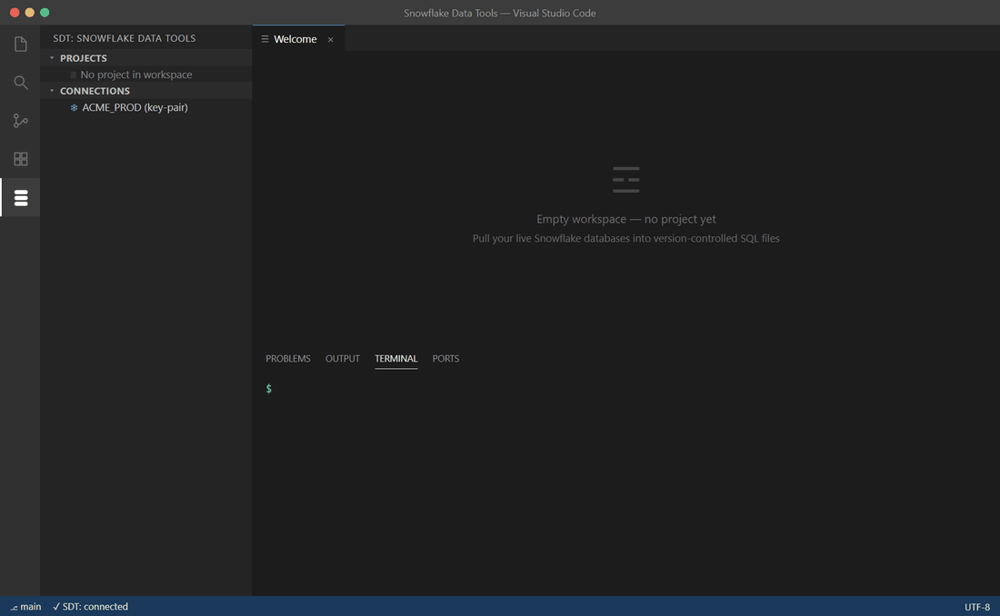

# 📥 Extract a live account

> Reverse-engineer a connected Snowflake account into a project tree of `.sql` files you can version, diff, and deploy.

**On this page:** [What extract does](#what-extract-does) · [CLI usage](#cli-usage) · [VS Code usage](#vs-code-usage) · [What gets extracted](#what-gets-extracted) · [Re-extract and refresh](#re-extract-and-refresh)

---

## What extract does



`sdt extract` connects to a live Snowflake account and writes one `.sql` file per object at a canonical path. The result is a working project tree — the same shape `sdt init` scaffolds — that you can build into a `.sdtpac`, compare against the account, and deploy.

It is the fastest way to bring an existing account under source control. Point it at a connection profile, choose how much to capture, and SDT walks every database, schema, and object in scope.

Each object lands at:

```
<output>/databases/<DB>/schemas/<SCHEMA>/<plural>/<NAME>.sql
```

Object types the path registry doesn't recognize fall into `<output>/_unsorted/` — the writer never refuses an object. Alongside the project tree, extract writes a model dump to `<output>/.sdt-cache/extracted.json` for downstream tooling.

> [!TIP]
> Run extract into a fresh, empty directory the first time. You get a complete, round-trippable project you can immediately `sdt build`.

---

## CLI usage

Register a connection first (see [Connections](connections.md)), then extract:

```sh
# Full account capture into a new project tree
sdt extract --connection prod --output ./MyProject

# Limit to specific object types (comma-separated)
sdt extract --connection prod \
            --types TABLE,VIEW,PROCEDURE \
            --output ./MyProject
```

| Flag | What it does | Notes |
|---|---|---|
| `--connection <name>` | The Snowflake connection profile to read from. | Required. Register with `sdt connection add`. |
| `--output <dir>` | Where to write the project tree (and `.sdt-cache/extracted.json`). | Emits a tree round-trippable with `sdt build`. |
| `--types <list>` | Comma-separated object-type filter — extract only the named types. | Omit to extract every supported type. |

After extract, build the project to confirm it round-trips:

```sh
sdt build --project ./MyProject.sdtproj --out ./bin/MyProject.sdtpac
```

---

## VS Code usage

Run **SDT: Extract Snowflake Account → Project** from the Command Palette (<kbd>Ctrl</kbd>+<kbd>Shift</kbd>+<kbd>P</kbd>). The command prompts for a connection and an output folder, then writes the project tree for you — no terminal required.

The extracted `.sql` files open like any other project files: edit them, and the VS Code editor flags missing-column references inline while you work.

---

## What gets extracted

SDT models the full Snowflake catalogue. Each object type is captured one of two ways:

- **Fully modeled** — SDT understands the object's structure (columns, types, options) and can diff it field-by-field.
- **Extracted as-is (DDL)** — SDT captures the object's `GET_DDL` text verbatim. Compare is DDL-string equality; this is enough until a hand-tuned model is needed.

Coverage by object family:

| Object family | Examples | Coverage |
|---|---|---|
| Tables | `TABLE` | Fully modeled |
| Table variants | `EXTERNAL_TABLE`, `ICEBERG_TABLE`, `HYBRID_TABLE`, `DYNAMIC_TABLE`, `EVENT_TABLE` | Extracted as-is (DDL) |
| Views | `VIEW`, `MATERIALIZED_VIEW`, `SECURE_VIEW` | Extracted as-is (DDL) |
| Pipeline objects | `STREAM`, `TASK`, `PIPE` | Extracted as-is (DDL) |
| Routines | `PROCEDURE`, `FUNCTION`, `EXTERNAL_FUNCTION`, `DATA_METRIC_FUNCTION` | Extracted as-is (DDL) |
| Storage & loading | `SEQUENCE`, `FILE_FORMAT`, `STAGE` | Extracted as-is (DDL) |
| Governance policies | `MASKING_POLICY`, `ROW_ACCESS_POLICY`, `AGGREGATION_POLICY`, `PROJECTION_POLICY`, `PRIVACY_POLICY`, `JOIN_POLICY`, `TAG` | Extracted as-is (DDL) |
| Database & schema | `DATABASE`, `SCHEMA`, `DATABASE_ROLE` | Extracted as-is (DDL) |
| Account objects | `WAREHOUSE`, `RESOURCE_MONITOR`, `ROLE`, `NETWORK_POLICY`, integrations (`API`, `STORAGE`, `EXTERNAL_ACCESS`, …) | Extracted as-is (DDL) |

> [!NOTE]
> GRANTs are never part of `GET_DDL` output, and grant extraction is not included in the current beta — manage grants outside SDT for now. Policy and tag attachments are captured where the object model supports them.

Some newer object types (for example `MCP_SERVER`, `CORTEX_AGENT`, `MODEL`) are typed but not yet extracted. See the full per-type status table in the source repository if you need an exact breakdown.

---

## Re-extract and refresh

Re-run `sdt extract` against an existing project to refresh it from the live account. Re-extraction overwrites object files with the account's current DDL, so it's the right move when the account has drifted ahead of your project tree.

A cleaner workflow once a project is under source control: instead of re-extracting blind, **compare first** to see exactly what changed, then pull only what you want.

```sh
# See what the account has that your project doesn't (and vice versa)
sdt compare ./MyProject.sdtproj 'snowflake://prod'
```

> [!IMPORTANT]
> Re-extracting into a git-tracked project, then reviewing the diff, is the safest refresh path — you see every change before committing it.

See [Schema compare](schema-compare.md) for the full compare workflow.

---

**Next:** [Schema compare](schema-compare.md) · **Up:** [Documentation home](README.md)
